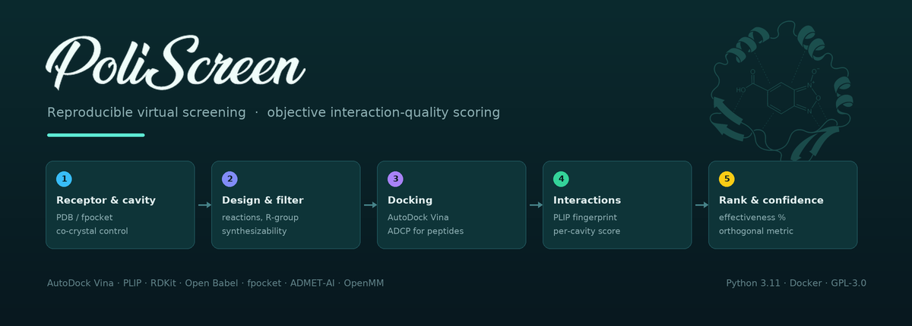

# PoliScreen

Reproducible virtual screening that closes the loop **design → synthesizability
filter → docking → interaction-quality scoring → ADMET**, with an objective
per-cavity scoring function and an orthogonal confidence metric.

> **v1.0.0** — full cycle functional and validated on real targets.

---

## Why another docking front-end

Most screening panels rank by *affinity* and *contact count*. That rewards
promiscuity: a molecule touching many irrelevant residues can outrank one that
anchors exactly where it should. PoliScreen is built on four ideas.

1. **Objective per-cavity scoring, not similarity to the control.** Interaction
   quality is the sum of each contact weighted by **bond type** (salt bridge >
   H-bond > π > hydrophobic) and by **residue role** (catalytic, secondary,
   cavity, external). It is normalized against the fingerprint of the
   **crystallographic ligand in its real pose** — so a compound beats the
   control by making **more and better productive contacts**, not by copying it.

2. **Confidence metric, orthogonal to the score.** `confidence` (0–1) is the
   **geometric** mean of binding-mode convergence across poses, affinity↔interaction
   agreement, and (if enabled) Vina↔neural-network consensus, attenuated when the
   control fails to reproduce its crystallographic pose. It quantifies **how much
   to trust** a result, not its magnitude. A high score with low confidence is a
   red flag.

3. **Synthesizability from the design stage.** Analogues are filtered by real
   reaction feasibility (regioselectivity, OH classification, steric hindrance),
   so what gets docked is what a chemist can actually make.

4. **Explicit reproducibility.** Fixed seed, one thread per docking, and a
   Methods export with every parameter and version. Inside one container image,
   two runs of the same configuration give the same result — and the image digest
   is what a paper cites. Across different installs they do not: three steps of the
   pipeline do floating-point arithmetic in libraries compiled per platform.
   `poliscreen fingerprint` hashes each stage so two machines can be compared.

The co-crystallised control defines the reference everything is measured against,
so its chemistry is not guessed: bond orders come from the **PDB's own chemical
component dictionary**, looked up from the ligand code. A PDB file stores
coordinates, not bonds, and letting a converter infer them gave different molecules
on different machines.

A single interaction engine (**PLIP**) feeds both the table and the diagrams:
same author numbering, same bond types, no mismatch between what is measured and
what is drawn.

The interface is available in **English and Spanish** (Settings → Language). Only
the interface changes: results, column names and file names are the same in both,
so a table exported from either reads the same way.

Nothing leaves your machine unless you ask for it. Sessions and export packages
carry no local paths, so they can be shared as they are and opened on another
machine.

---

## Install

**Windows, no terminal**: install Docker Desktop, download `PoliScreen-Docker.bat`
from the [latest release](https://github.com/DiegoAnyG/PoliScreen/releases/latest),
double-click it.

**Anywhere with Docker**:

```bash
docker run --rm -it --init -p 127.0.0.1:8501:8501 \
  -v "$PWD/proyectos:/data" ghcr.io/diegoanyg/poliscreen:latest
# then open http://localhost:8501
```

Requirements, including the obvious: **[docs/REQUIREMENTS.md](docs/REQUIREMENTS.md)**.
Every route, and conda for development: **[docs/INSTALL.md](docs/INSTALL.md)**.

---

## Workflow

PoliScreen is a Python library with a CLI; the web UI is a thin layer on top —
everything the UI does is reproducible from the command line.

1. **Receptors** — fetch or upload the structure, choose what to keep, extract
   the co-crystallized ligand as the control.
2. **Ligands** — build a series by reaction, screen approved drugs from ChEMBL
   under property filters, enumerate peptides, or upload ready structures. The
   sources add up: one run can hold compounds from several.
3. **Run** — define the search box and launch docking.
4. **Results** — adjust the weighting and inspect the ranking.

A step-by-step guide with the scientific rationale of each control is in
**[docs/TUTORIAL.md](docs/TUTORIAL.md)**.

---

## Engines

Small molecules are docked with **AutoDock Vina 1.2.5**; peptides (5–20 residues)
are routed automatically to **AutoDock CrankPep (ADCP)**. Poses can be re-scored
with the **gnina** neural network (optional, GPU) as an independent second
opinion that feeds the confidence metric. Cavities are detected with **fpocket**;
interactions profiled with **PLIP**.

**Transport tunnels** are read, not run. A docking score says how well a compound
sits in the site and nothing about whether it can reach it; point the Results tab
(or `poliscreen tunnels <folder>`) at a CaverWeb download or at a folder of local
CaverDock runs and it reports `Ea`, `dE_BS` and the tunnel geometry, with the
combinations that never came back counted rather than hidden. Reading needs only
[caver-translate](https://github.com/DiegoAnyG/caver-translate); running CAVER or
CaverDock is a separate, opt-in step.

---

## Limitations

- **Rigid receptor**; no side-chain flexibility.
- **No covalent docking** (Vina and compatible engines do not model covalent bonds).
- **ADMET predictions are estimates** for prioritization, not experimental
  measurements.

---

## Citation

See **[CITATION.cff](CITATION.cff)** (GitHub renders it under *Cite this
repository*). Cite also the tools PoliScreen runs; the full list with references
is in the app's *How to cite* panel and in the exported Methods file.

## License

**GNU GPL v3 or later** (see [LICENSE](LICENSE)). The scientific tools PoliScreen
runs (Vina, ADCP, PLIP, RDKit, Open Babel, fpocket, gnina) are independent
programs invoked as separate processes and keep their own licenses; PoliScreen
does not incorporate their code.

## Author

**Diego Cesar Anaya Guerrero**
